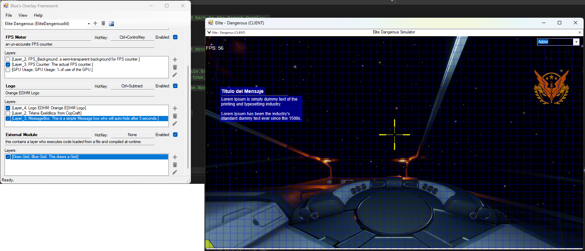

# Direct2DGameOverlay
An Overlay for games or any program using [Direct2D](https://learn.microsoft.com/en-us/windows/win32/direct2d/direct2d-portal).

Still on alpha but i'll be publishing working Releases.
Tested with the 'Elite Dangerous' game.

Based on:
- [SharpDX](https://github.com/sharpdx/SharpDX)
- [Overlay.NET](https://github.com/lolp1/Overlay.NET) 
- [Process.NET](https://github.com/lolp1/Process.NET)
- [NIKBH - NonInvasiveKeyboardHook](https://github.com/kfirprods/NonInvasiveKeyboardHook)

Requeriments:
- [.NET Framework 4.8](https://dotnet.microsoft.com/es-es/download/dotnet-framework/net48)
- [Visual Studio 2022](https://visualstudio.microsoft.com/thank-you-downloading-visual-studio/?sku=Community&channel=Release&version=VS2022)

Features:
- No Coding needed to draw basic shapes on the overlay, you can either use the UI or edit the JSON.
- But.. to draw advanced stuff you can attach a code file (C#) in the example i draw a blue grid from an external module.
- The overlay can be attached to any window or game, even to the Notepad !!!
